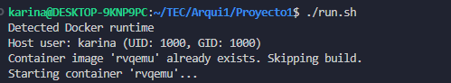
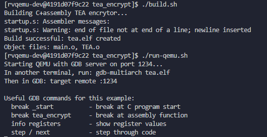
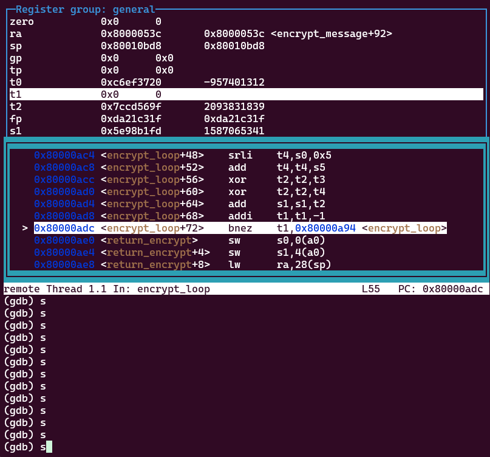
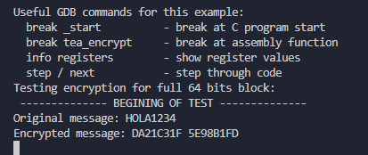
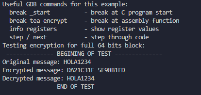
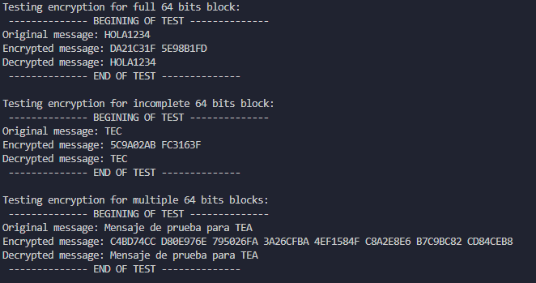
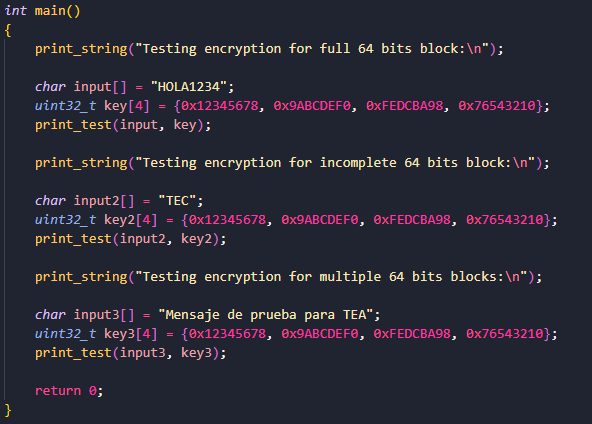

# Introducción

El presente proyecto tiene como objetivo la implementación del algoritmo de encripción Tiny Encryption Algorithm (TEA) sobre una arquitectura RISC-V en un entorno bare-metal. El algoritmo TEA es un cifrador que trabaja con bloques de 64 bits y utiliza llaves de 128 bits, conocido por su simplicidad, eficiencia y reducido consumo de memoria, lo que lo hace adecuado para sistemas embebidos y dispositivos con recursos limitados.

La implementación se realiza para cadenas de caractéres de longitud variable, permitiendo demostrar la versatilidad del algoritmo.

# Arquitectura de software

Descripción de la arquitectura del software: Separación entre capas C y ensamblador, interfaces utilizadas, y justificación de las decisiones de diseño.

La aplicación se divide en dos secciones principales:

 ### 1. Capa de aplicación y gestión de memoria (C)
 
Esta capa es responsable de la interacción con el usuario y del manejo de cadenas de caracteres.

- Incluye funciones para dividir el mensaje en bloques de 64 bits, aplicar relleno en caso de mensajes incompletos y reconstruir el texto una vez desencriptado.

- Implementa utilidades como impresión en formato decimal y hexadecimal, necesarias en entornos bare-metal donde no existe un sistema operativo ni librerías estándar avanzadas.

- Implementa las llamadas a las rutinas de encripción y desencripción escritas en ensamblador, proporcionando una interfaz de más alto nivel.

### 2. Capa criptográfica (Ensamblador RISC-V)

Esta capa implementa las rutinas de tea_encrypt y tea_decrypt optimizadas en ensamblador.

- Se implementa siguiendo las convenciones de RISC-V para el uso de parámetros (a0-a7), valores de retorno (a0), y preservación de registros (s0-s11)

- Reduce la sobrecarga en comparación con una implementación en C pura, lo que permite validar la eficiencia del algoritmo en un contexto cercano al hardware real.

Con esta división, la capa de aplicación solo requiere preparar los bloques y la llave, delegando el cálculo intensivo a las rutinas en ensamblador.

# Funcionalidades implementadas

Debido a las limitaciones del entorno bare-metal, fue necesario implementar funciones para la impresión de caractéres, de números y la conversión a hexadecimal.

### void decToHex(uint32_t decimalNum)
 La función void decToHex(uint32_t decimalNum) toma un número decimal y lo imprime en formato hexadecimal. 

### void print_hex(uint32_t *data, int nblocks)

 Utiliza la función decToHex para imprimir cada bloque de 64 bits encriptado

Para el procesamiento de las cadenas de caractéres, y su división en bloques de 64 bits, se implementaron las funciones:

### void to_block(char *input, uint32_t *value)

Esta función toma 8 caracteres, y los convierte a un entero y llena un arreglo con los 64 bits. Implementa un padding con ceros si la cadena es de menos de 8 caracteres.

### void from_block(char *output, uint32_t *value)

Esta función toma un arreglo con 64 bits y los convierte a una cadena de caractéres.

### void encrypt_message(char *input, int nblocks, uint32_t *key, uint32_t *encrypted)

Esta función el mensaje, la llave de encripción y la cantidad de bloques de 8 bytes necesarios para el algoritmo TEA. El mensaje encriptado se guarda en encrypted.

### void decrypt_message(uint32_t *encrypted, int nblocks, uint32_t *key, char *decrypted)

Esta función toma el mensaje encriptado, la llave y la cantidad de bloques de 8 bytes que componen el mensaje. El resultado lo guarda en decrypted

### void print_test(char *input, uint32_t *key)

Función que se encarga de imprimir una prueba completa, incluyendo encripción y desencripción 

# Ejemplos de ejecución

### Inicio del contenedor y compilación





### Depuración con GBD



En la imagen anterior se observa la depuración paso a paso con GBD, se puede observar el registro t1 que contiene un contador para las rondas de encriptación del algoritmo TEA, y se observa también el resultado de la encriptación en los registros fp o s0 y s1.

### Ejecución en QEMU



La imagen anterior muestra la salida parcial después de completar el proceso de encriptación, y se observa el mismo resultado en hexadecimal del proceso de encriptación.

Finalmente, se observa la salida de la prueba completa para la cadena: HOLA1234, que demuestra el proceso para un bloque completo de 64 bits.



# Resultados

La aplicación permite la encriptación de cadenas de caractéres de longitud variable, determinando de manera automática la cantidad de rondas de encripción y la división de la cadena en bloques de 64 bits. Además aplica un padding con ceros en caso de bloques incompletos y muestra la salida del programa de forma amigable con el usuario.

Dadas las limitaciones del ambiente bare-metal en QEMU se optó por incluir las cadenas de texto y las llaves directamente en el código fuente.

Se incluyen algunas pruebas que abarcan casos como bloques incompletos, un bloque de solamente 64 bits y un caso que implica multiples bloques.

# Uso del sistema

## Entorno de desarrollo RISC-V con QEMU y GDB

Para el entorno de desarrollo se utiliza un contenedor de Docker con QEMU y GBD para la depuración del código. El entorno permite el dessarollo y depuración de programas bare-metal en arquitectura RISC-V de 32 bits.

Se recomienda seguir estos pasos para instalar Docker en ambiente Linux / WSL: [Instalación](https://docs.docker.com/engine/install/ubuntu/) y [Pasos Post-instalación](https://docs.docker.com/engine/install/linux-postinstall/)

---

## Archivos de configuración

- `Dockerfile` define la imagen que incluye el emulador QEMU y el toolchain RISC-V
- `run.sh` automatiza la construcción de la imagen y la ejecución del contenedor
- `tea_encrypt/build.sh` automatiza la compilación de la aplicación
- `tea_encrypt/run-qemu.sh` inicia qemu con el ejecutable de la aplicación y prepara la depuración

---

## Pasos para iniciar la aplicación

### Paso 1: Construir el contenedor

El script `run.sh` construye la imagen `rvqemu` y crea un contenedor interactivo que monta el directorio del proyecto en `/home/rvqemu-dev/workspace`.

```bash
chmod +x run.sh
./run.sh
```

### Paso 2: Compilar aplicación

Se incluye un script `build.sh` que maneja la compilación automáticamente.

**Opciones de compilación utilizadas**:
- `-march=rv32im`: arquitectura RISC-V 32 bits con extensiones I y M
- `-mabi=ilp32`: ABI ILP32
- `-nostdlib -ffreestanding`: entorno bare-metal
- `-g`: información de depuración para GDB

```bash
cd /home/rvqemu-dev/workspace/tea_encrypt
./build.sh
```

### Paso 3: Ejecutar con QEMU y depurar

```bash
# En una terminal: inicia QEMU con servidor GDB
./run-qemu.sh

# En otra terminal: conectar GDB
docker exec -it rvqemu /bin/bash
cd /home/rvqemu-dev/workspace/tea_encrypt
gdb-multiarch tea.elf
```

1. **QEMU**: `run-qemu.sh` inicia QEMU con servidor GDB en puerto 1234
2. **GDB**: Conectar desde otra terminal para depuración interactiva

**Comandos útiles de GDB**:
```gdb
target remote :1234    # Conectar al servidor GDB
break tea_encrypt      # Función para encriptar mensaje
break tea_decrypt      # Función para desencriptar mensaje
continue o c           # Continuar ejecución
layout asm             # Vista de ensamblador
layout regs            # Vista de registros
step o s               # Ejecutar siguiente instrucción
info registers         # Mostrar registros
monitor quit           # Finalizar sesión
```

## 4. Ejecutar sin depurar

Después de iniciar el contenedor 

```bash
cd /home/rvqemu-dev/workspace/tea_encrypt
# Inicia QEMU y corre el ejecutable de la aplicación
qemu-system-riscv32 -machine virt -nographic -bios none -kernel tea.elf

```
Se debe obtener la siguiente salida para los ejemplos que vienen por defecto:



## 5. Agregar pruebas

Las pruebas se encuentran codificadas en el archivo main.c ubicado en la carpeta src, se pueden agregar nuevas cadenas de caractéres y llaves en la función main de la aplicación. Debe recordar respetar el tamaño de la llave, de 128 bits.



